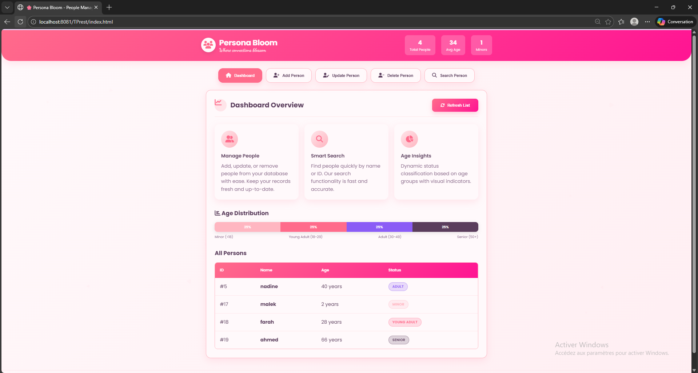
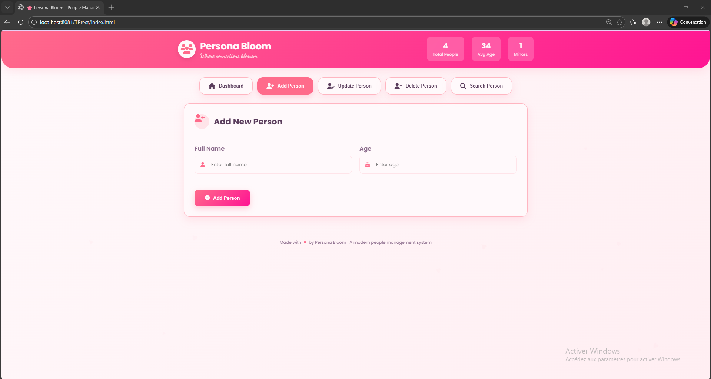
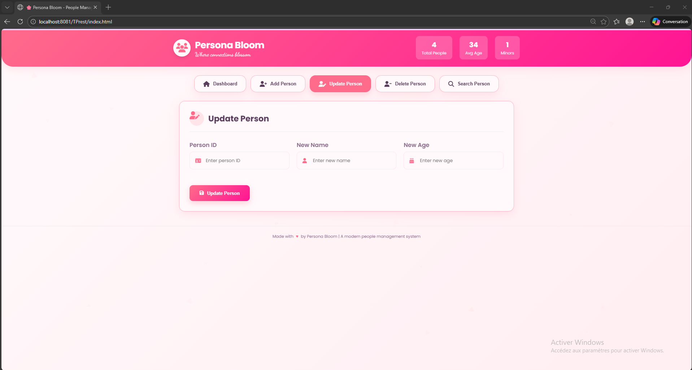
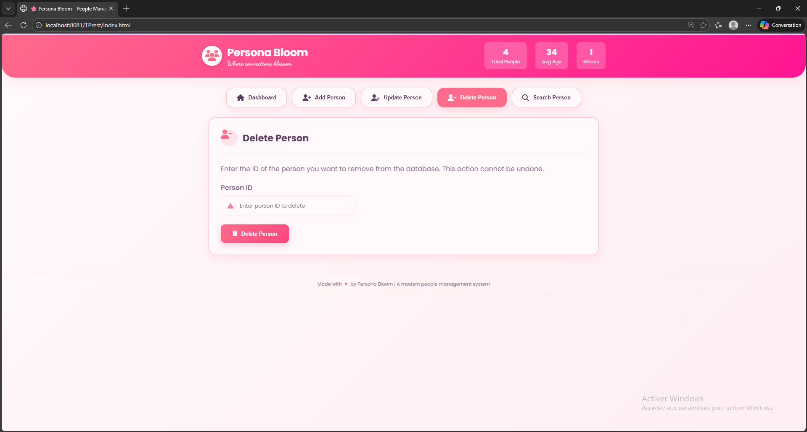
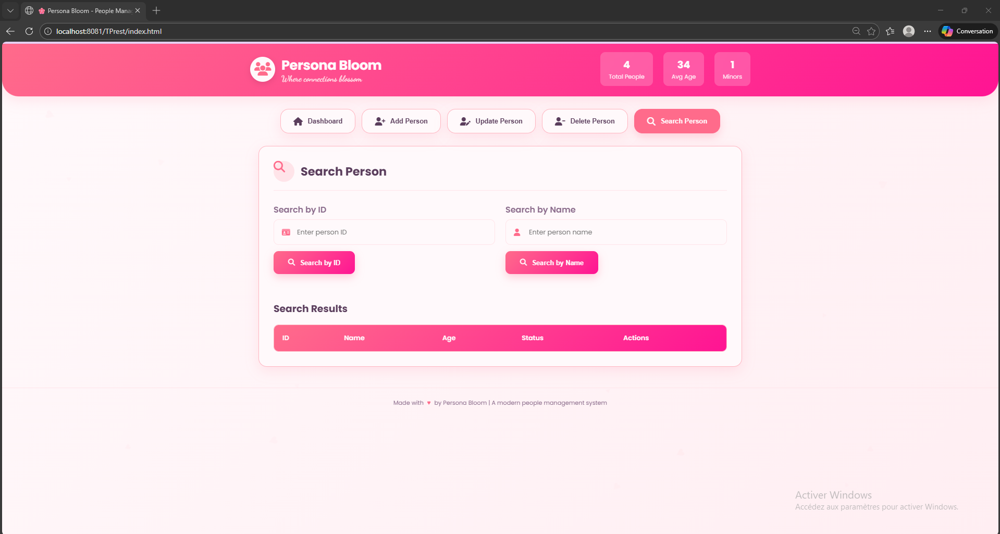

# Persona-Bloom

# Gestion des Personnes - Application Web

## Description du projet
Ce projet est une application web de gestion de personnes, permettant de créer, lire, mettre à jour et supprimer des informations de personnes via une interface conviviale. L'application communique avec un **backend REST** pour la persistance des données. Elle inclut également des fonctionnalités visuelles interactives telles que des badges de statut, des statistiques et des animations.  

L’objectif principal est de démontrer une intégration complète **Frontend + Backend** avec gestion des données, validation et visualisation dynamique.

---

## Fonctionnalités

### 1. Dashboard
- Affiche la liste complète des personnes stockées dans la base de données.
- Statistiques dynamiques :
  - Nombre total de personnes.
  - Âge moyen.
  - Distribution par tranche d’âge (Mineur, Jeune Adulte, Adulte, Senior) avec un **graphique visuel interactif**.
- Badge de statut selon l’âge avec codes couleurs.
- Messages de notification (toasts) pour chaque action réussie ou erreur.

### 2. Ajouter une personne
- Formulaire avec validation des champs (nom et âge).
- Aperçu en temps réel du **statut basé sur l’âge** avant l’ajout.
- Envoi de la requête POST au backend pour créer la personne.
- Mise à jour automatique du tableau et des statistiques après ajout.

### 3. Mettre à jour une personne
- Formulaire de modification des informations existantes.
- Vérification si la personne existe via le backend avant mise à jour.
- Aperçu en temps réel du statut mis à jour selon l’âge.
- Envoi de la requête PUT pour actualiser la personne.
- Rafraîchissement automatique des données et des statistiques.

### 4. Supprimer une personne
- Suppression sécurisée avec confirmation.
- Vérification si la personne existe avant suppression.
- Envoi de la requête DELETE vers le backend.
- Mise à jour dynamique du tableau et des statistiques.

### 5. Recherche
- Recherche par **ID** ou par **nom**.
- Affichage des résultats dans un tableau dédié.
- Actions disponibles depuis les résultats : **Modifier** ou **Supprimer** directement.
- Gestion des cas où aucune personne n’est trouvée.

### 6. Notifications visuelles
- Système de toast pour afficher :
  - Succès des actions.
  - Erreurs (champ vide, personne non trouvée, erreur serveur).
  - Avertissements.
- Couleurs et icônes adaptées selon le type de notification.

### 7. Animations et effets
- Badges colorés pour chaque tranche d’âge.

---

## Technologies utilisées
- **Frontend :** HTML, CSS, JavaScript
- **Backend :** Java (JAX-RS avec JDBC et requêtes SQL) + REST API
- **Base de données :** MySQL

---
## Project Structure

- `src/` : Contient le code source Java du backend.
- `WebContent/` : Contient tous les fichiers frontend : HTML, CSS, JavaScript.
- `screenshots/` : Contient les captures d’écran de l’application.

---

## Instructions pour exécuter le projet

1. **Cloner le projet depuis GitHub :**
2. **Ouvrir le projet dans Eclipse :**
Importer le projet si nécessaire : File > Import > Existing Projects into Workspace.

Vérifier que Tomcat v9 est configuré dans Eclipse (Window > Preferences > Server > Runtime Environments).

3. **Exécuter le projet :**

Lancer le serveur Tomcat v9 depuis Eclipse.

Accéder à l'application via votre navigateur à l’adresse : http://localhost:8081/TPrest/index.html

4. **Utilisation de l’application :**

Dashboard : visualiser toutes les personnes et les statistiques.

Ajouter une personne : remplir le formulaire nom/âge et cliquer sur "Add Person".

Mettre à jour une personne : saisir l’ID, le nouveau nom et âge, puis cliquer sur "Update Person".

Supprimer une personne : saisir l’ID et confirmer la suppression.

Rechercher une personne : par ID ou par nom, avec options pour modifier ou supprimer depuis les résultats.

---
## Vidéo de démonstration

Vous pouvez visionner la vidéo de démonstration du projet ici : [Lien vers la vidéo](https://drive.google.com/drive/folders/1a0AWYjIV5om59GVEtxF0RUJP3dz2tvTT?usp=sharing))
